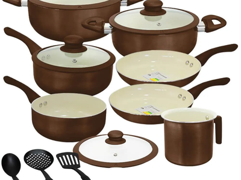

# Tipos de Panelas

## 1. Introdução
Ao cozinhar em um ambiente profissional ou doméstico, a escolha da panela correta influencia diretamente no sabor, na textura e na eficiência do preparo dos alimentos. Este guia detalha os principais tipos de panelas, seus usos, vantagens e desvantagens.

## 2. Objetivo
Fornecer informações detalhadas sobre os diferentes tipos de panelas, suas aplicações e dicas de uso para auxiliar na preparação de pratos de alto padrão gastronômico.

## 3. Público-alvo
Este guia é destinado a chefs profissionais, cozinheiros amadores e entusiastas da gastronomia que desejam aprimorar técnicas culinárias através do uso adequado de panelas.

## 4. Tipos de Panelas

### 4.1. Panela de Aço Inox

#### 4.1.1. Vantagens
  - Alta durabilidade
  - Distribui bem o calor
  - Não libera substâncias tóxicas
  - Mantém a temperatura estável

#### 4.1.2. Desvantagens
  - Pode grudar alimentos sem revestimento adequado
  - Custo elevado
  
#### 4.1.3. Caso de uso
  - Preparos que necessitam de cozimento uniforme, como molhos e risotos

### 4.2. Panela de Ferro Fundido

#### 4.2.1. Vantagens
  - Excelente retenção de calor
  - Enriquece os alimentos com ferro
  - Ideal para cozimento lento

#### 4.2.2. Desvantagens
  - Pesada
  - Requer manutenção contra ferrugem

#### 4.2.3. Caso de uso
  - Carnes grelhadas, ensopados, guisados

### 4.3. Panela de Cobre

#### 4.3.1. Vantagens
  - Excelente condutividade térmica
  - Controle preciso de temperatura

#### 4.3.2. Desvantagens
  - Requer revestimento interno seguro (inox ou estanhado)
  - Custo elevado e alta manutenção

#### 4.3.3. Caso de uso
  - Preparos delicados como caldas, caramelos e molhos

### 4.4. Panela de Alumínio

#### 4.4.1. Vantagens
  - Leve
  - Aquece rapidamente
  - Preço acessível

#### 4.4.2. Desvantagens
  - Pode reagir com alimentos ácidos
  - Tende a desgastar-se rapidamente

#### 4.4.3. Caso de uso
  - Frituras e cozimentos rápidos

### 4.5. Panela Antiaderente (Teflon e Cerâmica)

**Panela Teflon**

**Panela ceramica**
#### 4.5.1. Vantagens

  - Requer menos óleo no preparo
  - Fácil limpeza

#### 4.5.2. Desvantagens
  - Sensível a arranhões
  - Não suporta temperaturas extremamente altas

#### 4.5.3. Caso de uso
  - Omeletes, panquecas, peixes e pratos delicados

### 4.6. Panela de Vidro

#### 4.6.1. Vantagens
  - Não libera substâncias tóxicas
  - Permite visualizar o cozimento

#### 4.6.2. Desvantagens
  - Frágil
  - Pouca distribuição de calor

#### 4.6.3. Caso de uso
  - Assados e cozidos no forno

### 4.7. Panela de Barro

#### 4.7.1. Vantagens
  - Conserva bem o calor
  - Realça o sabor dos alimentos

#### 4.7.2. Desvantagens
  - Quebra facilmente
  - Requer cura para evitar rachaduras

#### 4.7.3. Caso de uso
  - Moquecas, feijoadas e pratos regionais

### 4.8. Panela de Titânio

#### 4.8.1. Vantagens
  - Extremamente resistente
  - Não libera toxinas
  - Boa distribuição de calor

#### 4.8.2. Desvantagens
  - Preço elevado

#### 4.8.3. Caso de uso
  - Preparos diversos, substituindo inox ou ferro

## 5. Guia de Uso e Manutenção

| Tipo de Panela | Cuidados Principais |
|---------------|------------------|
| Aço Inox | Evitar superaquecimento, usar esponjas não abrasivas |
| Ferro Fundido | Manter sempre untada para evitar ferrugem |
| Cobre | Polir regularmente e evitar uso de materiais corrosivos |
| Alumínio | Evitar uso com alimentos muito ácidos |
| Antiaderente | Usar utensílios de silicone ou madeira |
| Vidro | Evitar choques térmicos |
| Barro | Fazer cura com óleo antes do primeiro uso |
| Titânio | Lavar apenas com sabão neutro |

!!! warning "Cuidado com Panelas de Alumínio"
    Panelas de alumínio podem reagir com alimentos ácidos, liberando metais pesados no preparo. Evite uso prolongado com tomates e limão.

## 6. Referências
- Livros de gastronomia profissional
- Relatórios de segurança alimentar
- Estudos sobre materiais culinários

