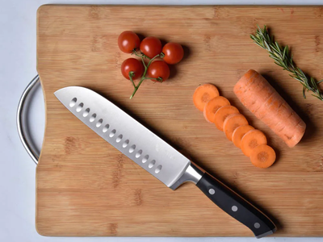
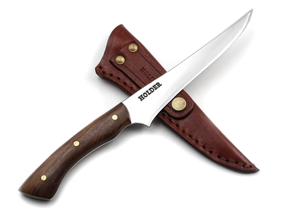
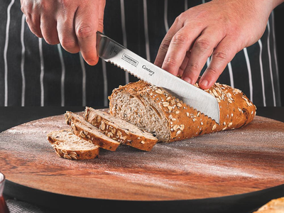
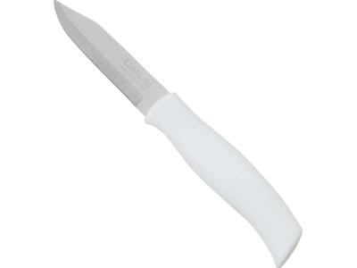
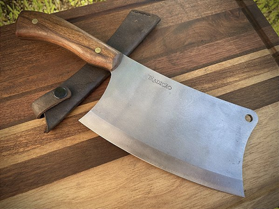
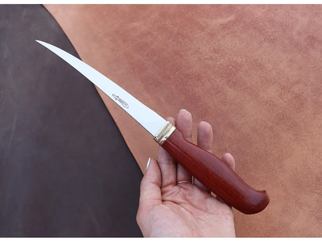

# Uso Correto de Facas

## 1. Introdução
O uso correto de facas é essencial na culinária profissional e doméstica. A escolha adequada da faca, sua manutenção e técnicas de corte impactam diretamente na segurança, eficiência e qualidade do preparo dos alimentos.

## 2. Objetivo
Este documento visa orientar chefs e entusiastas da gastronomia sobre o uso correto de facas, abordando tipos, técnicas de corte, manutenção e segurança na cozinha.

## 3. Público-Alvo
- Chefs profissionais e amadores
- Estudantes de gastronomia
- Entusiastas da culinária

## 4. Tipos de Facas e Suas Funções
Cada tipo de faca tem uma função específica. Abaixo estão descrições detalhadas sobre cada uma delas:

### 4.1. Faca do Chef

A faca mais versátil da cozinha, com uma lâmina longa e afiada, ideal para cortes gerais, picar ervas, fatiar carnes e legumes. Seu formato facilita o movimento de balanço ao cortar.

### 4.2. Faca Santoku

De origem japonesa, tem uma lâmina larga e curta com alvéolos que evitam que os alimentos grudem. É excelente para cortes rápidos e precisos de vegetais, carnes e peixes.

### 4.3. Faca de Desossa

Com uma lâmina fina e rígida ou flexível, esta faca é usada para separar a carne dos ossos, facilitando a remoção de gorduras e tendões sem desperdício.

### 4.4. Faca de Pão

Com uma lâmina serrilhada, é projetada para cortar pães e bolos sem amassá-los, garantindo cortes limpos e uniformes.

### 4.5. Faca de Legumes

Pequena e precisa, ideal para descascar e cortar pequenos vegetais, proporcionando maior controle ao manusear alimentos delicados.

### 4.6. Cutelo

Com uma lâmina larga e pesada, é utilizado para cortes rápidos e para quebrar ossos ou peças de carne mais rígidas.

### 4.7. Faca de Filetar

Com uma lâmina fina e flexível, é essencial para filetar peixes e carnes macias com precisão, garantindo cortes limpos.

Abaixo está uma tabela resumindo as principais facas utilizadas na cozinha profissional.

| Tipo de Faca       | Descrição e Uso |
|-------------------|----------------------------------------------------|
| Faca do Chef      | Versátil, ideal para cortes gerais e picar alimentos |
| Faca Santoku      | Similar à faca do chef, mas com lâmina mais curta e larga |
| Faca de Desossa   | Usada para separar carne dos ossos |
| Faca de Pão      | Serra, indicada para cortar pães e bolos sem amassar |
| Faca de Legumes   | Pequena e precisa, ideal para descascar e cortar pequenos vegetais |
| Cutelo            | Lâmina larga, usada para cortes rápidos e carnes com osso |
| Faca de Filetar   | Lâmina flexível, ideal para peixes e carnes macias |

## 5. Técnicas de Corte
### 5.1. Posição Correta das Mãos
- **Mão dominante:** segura firmemente a faca pelo cabo, mantendo o controle da lâmina.
- **Mão de apoio:** faz a fixação do alimento, com os dedos curvados para evitar cortes acidentais.

### 5.2. Principais Tipos de Corte
| Tipo de Corte | Descrição |
|--------------|------------------------------------------------|
| Julienne    | Cortes finos e longos, similares a palitos |
| Brunoise    | Pequenos cubos, geralmente usados para mirepoix |
| Chiffonade  | Fatias finas de folhas verdes |
| Batonnet    | Cortes um pouco maiores que julienne |
| Concassé   | Tomate sem pele e sementes, cortado em cubos |
| Paysanne    | Cortes rústicos, geralmente em lâminas finas |

## 6. Manutenção e Afiação
- **Armazenamento:** Facas devem ser guardadas em suportes magnéticos ou blocos de madeira para evitar desgaste.
- **Limpeza:** Sempre lavar e secar imediatamente após o uso para evitar oxidação.
- **Afiação:** Utilizar chaira regularmente e pedra de afiar conforme necessidade.

### 6.1. Chaira

<iframe
    width="560"
    height="315"
    src="https://www.youtube.com/embed/jNoqsNRPSYE"
    frameborder="0"
    allow="accelerometer; autoplay; clipboard-write; encrypted-media; gyroscope; picture-in-picture"
    allowfullscreen>
</iframe>

### 6.2. Pedra

<iframe
    width="560"
    height="315"
    src="https://www.youtube.com/embed/ByimatxymRI"
    frameborder="0"
    allow="accelerometer; autoplay; clipboard-write; encrypted-media; gyroscope; picture-in-picture"
    allowfullscreen>
</iframe>

## 7. Segurança no Uso de Facas
- Sempre mantenha os dedos dobrados ao cortar alimentos.
- Nunca deixe facas submersas em água para evitar acidentes.
- Certifique-se de que a superfície de corte está estável.
- Utilize tábuas de corte adequadas, evitando vidro e superfícies escorregadias.

## 8. Referências
- Escoffier, A. "Guia Culinária"
- McGee, H. "Comida e Cozinha: Ciência e Cultura da Culinária"

