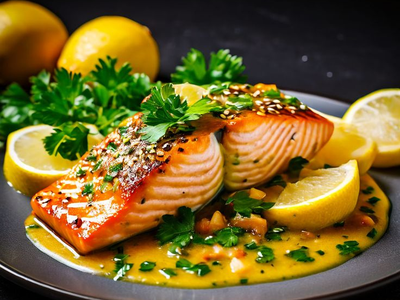
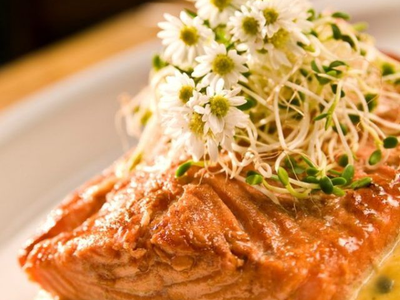
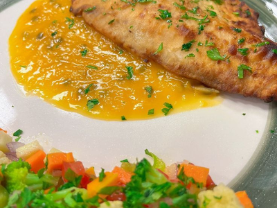
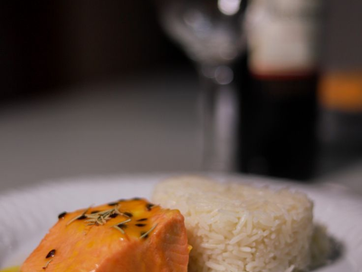

# Frango ao Molho de Maracujá

## 1. Introdução
Frango ao Molho de Maracujá é um prato sofisticado e saboroso, que combina a suavidade do frango com o sabor agridoce do maracujá. Esta receita é ideal para almoços e jantares especiais.

## 2. Objetivo
Documentar o preparo da receita de Frango ao Molho de Maracujá, incluindo ingredientes, modo de preparo e dicas para melhor execução.

## 3. Público-Alvo
Esta receita é indicada para qualquer pessoa interessada em culinária, desde iniciantes até cozinheiros experientes que desejam aprimorar suas habilidades.

## 4. Ingredientes
### 4.1. Para o Frango
- Filés de peito de frango
- Sal e pimenta-do-reino a gosto
- Suco de 1 limão
- 2 dentes de alho picados
- 2 colheres de sopa de azeite
- 1 ramo de tomilho
- 1 ramo de alecrim (opcional, intensifica o sabor)

### 4.2. Para o Molho de Maracujá
- 2 maracujás frescos (polpa com sementes)
- 200 ml de creme de leite fresco
- 2 colheres de sopa de açúcar
- 1 colher de sopa de manteiga
- Sal e pimenta-do-reino a gosto

## 5. Modo de Preparo
### 5.1. Preparando o Frango
1. Tempere os filés de frango com sal, pimenta-do-reino e suco de limão.
2. Adicione o alho picado e deixe marinar por pelo menos 30 minutos.
3. Em uma frigideira, aqueça o azeite em fogo médio.
4. Adicione o frango e grelhe por aproximadamente 5 minutos de cada lado ou até dourar.
5. Reserve o frango.

### 5.2. Preparando o Molho de Maracujá
1. Em uma panela, derreta a manteiga em fogo médio.
2. Adicione a polpa dos maracujás e cozinhe por 2 minutos.
3. Acrescente o açúcar e misture bem.
4. Adicione o creme de leite fresco e cozinhe por mais 3 minutos, mexendo sempre.
5. Ajuste o sal e a pimenta-do-reino conforme preferência.

### 5.3. Finalização
1. Sirva os filés de frango em um prato.
2. Regue com o molho de maracujá quente.
3. Decore com folhas de tomilho ou alecrim, se desejar.

## 6. Dicas
- Para um molho mais suave, coe a polpa do maracujá antes de adicioná-la à panela.
- Se desejar um toque a mais, acrescente uma colher de sopa de mel ao molho.
- Acompanhe com arroz branco ou purê de batatas para um prato mais completo.

## 7. Empratamentos

### 7.1. Opção 1

1. **Base do prato**: Espalhe uma porção do molho de maracujá no centro do prato, criando uma camada uniforme.  
2. **Posicionamento do frango**: Coloque dois filés ligeiramente inclinados um sobre o outro para dar altura e volume ao prato.  
3. **Decoração com gergelim**: Polvilhe gergelim sobre a superfície do frango para adicionar textura e um toque sofisticado.  
4. **Disposição do limão**: Adicione fatias de limão ao redor do prato, equilibrando visualmente os elementos e trazendo frescor.  
5. **Finalização com ervas**: Finalize com folhas frescas de salsa ou coentro estrategicamente posicionadas para dar cor e contraste ao prato.  

### 7.2. Opção 2

1. **Base do prato**: Espalhe uma camada generosa do molho cremoso no centro do prato.  
2. **Posicionamento do frango**: Coloque o filé diretamente sobre o molho, garantindo que parte do molho fique visível ao redor.  
3. **Adição de brotos**: Disponha uma porção de brotos sobre o salmão, adicionando volume e textura.  
4. **Finalização com flores comestíveis**: Finalize com pequenas flores brancas comestíveis, criando um visual refinado e sofisticado.  

### 7.3. Opção 3

1. **Base do prato**: Aplique uma porção do molho amarelo em uma lateral do prato, criando uma superfície uniforme e levemente espalhada.  
2. **Posicionamento do frango**: Coloque o filé empanado diretamente sobre o molho, deixando parte dele visível para realce visual.  
3. **Finalização do frango**: Salpique salsinha fresca picada sobre o filé para dar cor e frescor.  
4. **Guarnição de legumes**: Disponha um mix de legumes coloridos (brócolis, cenoura, couve-flor, pimentões) na borda oposta do prato, equilibrando as cores e o volume.  
5. **Toque final**: Polvilhe mais um pouco de salsinha sobre os legumes para harmonizar os elementos e reforçar o frescor do prato.  

Esse empratamento destaca contraste de cores e texturas, criando um visual convidativo e sofisticado.

### 7.4. Opção 4

Para reproduzir esse empratamento considerando que a proteína é frango, siga estes passos:  

1. **Base do prato**: Coloque uma porção do molho amarelo no prato, criando uma leve cama para a proteína.  
2. **Posicionamento do frango**: Disponha o filé de frango suavemente sobre o molho, permitindo que parte dele escorra ao redor para um efeito visual agradável.  
3. **Formatação do arroz**: Utilize um aro ou uma tigela pequena para compactar o arroz, garantindo uma apresentação mais elegante e simétrica ao lado do frango.  
4. **Finalização da proteína**: Adicione um toque decorativo sobre o frango, como ervas secas ou frescas (como alecrim ou salsinha) para agregar contraste e sofisticação.  
5. **Disposição harmônica**: Certifique-se de que o arroz e o frango estejam levemente afastados, criando um equilíbrio visual entre os elementos no prato.  

