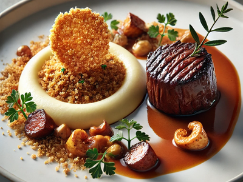

# Picadinho de Filé-Mignon com Purê de Mandioquinha e Farofa de Castanhas

## 1. Introdução
O Picadinho de Filé-Mignon com Purê de Mandioquinha e Farofa de Castanhas é uma receita sofisticada e saborosa que combina a suculência da carne com a cremosidade do purê e a crocância da farofa. Este prato é ideal para ocasiões especiais, proporcionando um equilíbrio perfeito de texturas e sabores.

## 2. Objetivo
Documentar detalhadamente os ingredientes e o modo de preparo da receita para facilitar sua execução, garantindo um resultado saboroso e refinado.

## 3. Público-Alvo
Esta receita é destinada a entusiastas da gastronomia, chefs amadores e qualquer pessoa interessada em preparar um prato elegante e saboroso para refeições especiais.

## 4. Ingredientes

### 4.1. Picadinho de Filé-Mignon
- 500g de filé-mignon em cubos pequenos
- 2 colheres (sopa) de azeite
- 1 cebola picada
- 2 dentes de alho picados
- 100ml de vinho tinto seco
- 1 colher (sopa) de molho inglês
- Sal e pimenta-do-reino a gosto

<iframe width="560" height="315" src="https://www.youtube.com/embed/MXMZ7ndH3Jw" frameborder="0" allowfullscreen></iframe>

### 4.2. Purê de Mandioquinha
- 500g de mandioquinha (batata-baroa)
- 1 colher (sopa) de manteiga
- 100ml de creme de leite fresco
- Noz-moscada, sal e pimenta a gosto

<iframe width="560" height="315" src="https://www.youtube.com/embed/J23vlAuu_WQ" frameborder="0" allowfullscreen></iframe>

### 4.3. Farofa de Castanhas
- 1 xícara de castanha-do-pará triturada
- 2 colheres (sopa) de manteiga
- 1 xícara de farinha de mandioca torrada
- Sal a gosto

<iframe width="560" height="315" src="https://www.youtube.com/embed/Pmbr_Fht6ZM" frameborder="0" allowfullscreen></iframe>

## 5. Modo de Preparo

### 5.1. Preparo do Picadinho de Filé-Mignon
1. Em uma panela, aqueça o azeite e refogue a cebola e o alho até ficarem dourados.
2. Adicione os cubos de filé-mignon e frite até que fiquem dourados por todos os lados.
3. Acrescente o vinho tinto seco e o molho inglês, mexendo bem para incorporar os sabores.
4. Cozinhe por cerca de 10 minutos, ajustando o sal e a pimenta-do-reino a gosto.
5. Reserve.

### 5.2. Preparo do Purê de Mandioquinha
1. Cozinhe a mandioquinha em água com sal até que fique macia.
2. Escorra a água e amasse a mandioquinha até obter um purê homogêneo.
3. Em uma panela, derreta a manteiga e adicione o purê de mandioquinha.
4. Acrescente o creme de leite fresco e misture bem até obter uma textura cremosa.
5. Tempere com noz-moscada, sal e pimenta-do-reino a gosto.

### 5.3. Preparo da Farofa de Castanhas
1. Em uma frigideira, derreta a manteiga e adicione a farinha de mandioca torrada.
2. Mexa constantemente até dourar levemente.
3. Acrescente as castanhas trituradas e misture bem.
4. Tempere com sal e continue mexendo até a farofa ficar crocante.

## 6. Empratamentos

### 6.1. Opção 1

- **Base de purê:** Com um bico de confeiteiro ou colher, disponha o purê de batatas em um formato circular no prato, deixando o centro vazio para formar um anel.
- **Farofa crocante:** Preencha o centro do anel de purê com a farofa crocante, espalhando uniformemente.
- **Molho:** Regue o prato com um molho brilhante ao lado do purê, sem encobrir os ingredientes principais.
- **Filé grelhado:** Coloque o picadinho de carne ao lado do purê, em cima do molho, levemente inclinado para destacar a textura grelhada.
- **Castanhas e cogumelos:** Distribua castanhas contornando o purê.
- **Finalização verde:** Adicione pequenos ramos de ervas frescas sobre os ingredientes para trazer cor e frescor ao prato.

### 6.2. Opção 2

- **Base de purê:** Com um bico de confeiteiro ou espátula, forme um anel de purê de batatas no centro do prato, garantindo bordas lisas e uniformes.  
- **Farofa crocante:** Preencha o centro do anel de purê com uma farofa crocante, criando uma base para a carne.  
- **Picadinho principal:** Posicione o picadinho sobre a farofa no centro do purê.  
- **Finalização do medalhão:** Coloque um pouco mais de farofa e um broto no topo do picadinho para trazer altura e sofisticação.  
- **Cortes auxiliares de carne:** Disponha cortes menores de carne ao redor do prato, equilibrando visualmente a composição. Alguns são deixados inteiros e outros cortados ao meio para exibir o ponto de cozimento.  
- **Pontos de purê:** Com um bico de confeiteiro, adicione pequenos montes de purê ao redor do prato.  
- **Molho:** Regue cuidadosamente o prato com um molho escuro em linhas circulares e pontilhadas para um efeito sofisticado.  
- **Finalização verde:** Acrescente pequenos brotos e ervas frescas para trazer frescor e um toque natural ao empratamento.

 

### 6.3. Opção 3

- **Base de purê:** Com uma espátula ou bico de confeiteiro, espalhe o purê de batatas em um formato circular no prato, criando uma base cremosa, mas como uma rosca.
- **Molho:** Regue o centro do pure com um molho escuro e brilhante.  
- **Anel de batata:** Posicione um anel de batata delicadamente texturizado no centro do purê para servir como base elevada.  
- **Cubos de carne:** Disponha cubos de carne suculentos sobre o anel de batata, garantindo altura e equilíbrio.  
- **Farofa e castanhas:** Salpique farofa crocante e castanhas em cima da rosca de purê.  
- **Finalização verde:** Decore com pequenos brotos e ervas frescas para um toque de cor e frescor.

 