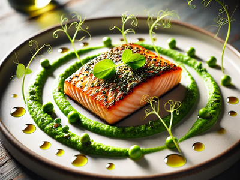
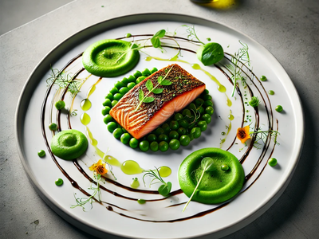

# Salmão Grelhado com Crosta de Ervas e Purê de Ervilhas

## 1. Introdução
Esta receita apresenta um prato sofisticado e saboroso de **salmão grelhado** com uma crosta de ervas crocante, acompanhado de um **purê de ervilhas** cremoso. É uma opção saudável e requintada, ideal para ocasiões especiais ou um jantar refinado.

## 2. Objetivo
Instruir sobre a preparação do salmão com crosta de ervas e purê de ervilhas, fornecendo uma receita detalhada com ingredientes e modo de preparo.

## 3. Público-Alvo
Cozinheiros iniciantes e intermediários que desejam preparar um prato refinado, equilibrado e nutritivo.

## 4. Ingredientes

### 4.1. Para o Salmão
- 2 postas de salmão (cerca de 200g cada)
- Sal e pimenta-do-reino a gosto
- 2 colheres (sopa) de azeite de oliva

### 4.2. Para a Crosta de Ervas
- 1 xícara de farinha panko (ou farinha de rosca grossa)
- 1 dente de alho picado
- 1 colher (sopa) de manteiga derretida
- 2 colheres (sopa) de salsinha fresca picada
- Raspas de 1 limão-siciliano
- Sal e pimenta-do-reino a gosto

### 4.3. Para o Purê de Ervilhas
- 300g de ervilhas congeladas
- 2 colheres (sopa) de manteiga
- 50ml de creme de leite fresco
- Sal e pimenta-do-reino a gosto

## 5. Modo de Preparo

### 5.1. Preparo do Salmão
1. Tempere as postas de salmão com sal e pimenta-do-reino a gosto.
2. Aqueça uma frigideira antiaderente em fogo médio-alto e adicione o azeite de oliva.
3. Grelhe o salmão por aproximadamente **3 minutos** de cada lado, ou até formar uma crosta dourada.
4. Retire do fogo e reserve.

### 5.2. Preparo da Crosta de Ervas
1. Em uma tigela, misture a farinha panko, o alho picado, a manteiga derretida, a salsinha e as raspas de limão.
2. Tempere com sal e pimenta-do-reino a gosto.
3. Cubra a parte superior das postas de salmão com essa mistura, pressionando levemente para aderir.
4. Leve ao forno preaquecido a **200ºC** por **5 minutos**, ou até dourar.

<iframe width="560" height="315" src="https://www.youtube.com/embed/a1H_jM4ttog" frameborder="0" allowfullscreen></iframe>

### 5.3. Preparo do Purê de Ervilhas
1. Cozinhe as ervilhas em água fervente por **5 minutos**, depois escorra.
2. No liquidificador ou processador, bata as ervilhas cozidas com a manteiga e o creme de leite fresco até obter um purê homogêneo.
3. Tempere com sal e pimenta-do-reino a gosto.

## 6. Empratamentos

### 6.1. Opção 1

- **Escolha do prato:** Prefira um prato branco e amplo, de formato redondo ou oval.  
- **Aplicação do purê:** Use uma colher ou bico de confeiteiro para colocar no prato e espalhar com um movimento circular ou diagonal.  
- **Posicionamento do salmão:** Disponha o filé ao centro do purê, destacando a crosta crocante.  
- **Adição de complementos:**  
    - Microgreens ou brotos para frescor.  
    - Fio de azeite aromatizado ao redor do prato.  
    - Flocos de sal ou raspas de limão para brilho e sabor.  
- **Toque final:** Limpe as bordas do prato e ajuste os elementos com uma pinça para um visual impecável.

### 6.2. Opção 2

- **Escolha do prato:** Use um prato grande, branco e com bordas elevadas.  
- **Base de ervilhas:** Disponha ervilhas inteiras no centro do prato formando um círculo, com aro culinário.  
- **Posicionamento do salmão:** Coloque o filé grelhado sobre a base de ervilhas, centralizando-o.  
- **Aplicação do purê:**  
  - Com um bico de confeiteiro ou colher, faça três círculos uniformes ao redor do prato.  
  - Use o fundo da colher para criar cavidades no centro dos círculos.  
- **Adição dos microgreens e flores comestíveis:**  
  - Distribua microgreens sobre o salmão e ao redor do prato.  
  - Acrescente flores comestíveis para um toque de cor.  
- **Acabamento e ajustes:**  
  - Use uma pinça de cozinha para posicionar os elementos com precisão.  
  - Limpe as bordas do prato para um acabamento impecável.

